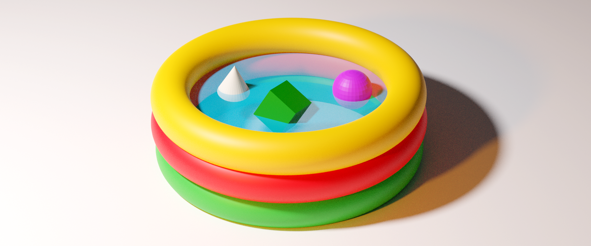

<table border="0" width="100%">
<tr>
<td style="border:none" width="600px"></td>
<td style="border:none">
<h1>Micro Front End Pool</h1>

</td>
</tr>
</table>
This is a project that is aimed at the large scale applications where building in parallel streams is crucial. 
Core tech stack here is based on Next.js and React App. 
Next.js is acting as a main entry point and also as a UI Shell, whereas React App is Micro Front End.

What is covered in this project so far:
 - Main UI Shell with routing
 - Micro Front End App
 - i18n
 
 What is planned to be covered:
  - Authentication mechanisms (on Node.js side, on client side, and using SSO)
  - Smoke tests
